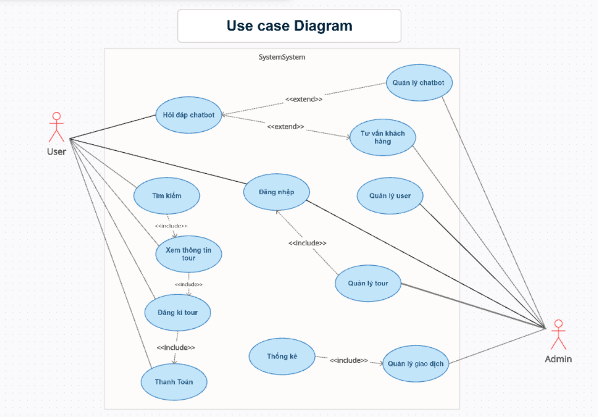

# ✈️ VistaNest Travels

> A travel website project created using **HTML, CSS and JavaScript, Python**.

🌐 **➡️ [Live Demo](https://nguyenthonhan.github.io/Service_Travel/client)

---

## 📋 Phân tích Yêu cầu

### a. 🎯 Đặt vấn đề bài toán

Hệ thống **quản lý tour du lịch** giúp người dùng:
- Tìm kiếm tour du lịch
- Đăng ký và thanh toán trực tuyến một cách tiện lợi

Tích hợp thêm:
- 🤖 **Chatbot AI** hỗ trợ tư vấn, giải đáp thắc mắc
- 🧠 **Đăng nhập bằng nhận diện khuôn mặt** giúp tăng cường bảo mật và cá nhân hóa trải nghiệm

---

### b. 👥 Tác nhân (Actors)

- **👤 User (Khách hàng)**: sử dụng hệ thống để tra cứu, đăng ký tour
- **🛠️ Admin (Quản trị viên)**: quản lý hệ thống và tương tác với chatbot

---

### c. ⚙️ Phân tích chức năng theo tác nhân

#### 👉 User:
- Đăng nhập bằng khuôn mặt
- Tìm kiếm tour
- Xem thông tin chi tiết tour
- Đăng ký tour
- Thanh toán trực tuyến
- Hỏi đáp, nhận tư vấn từ chatbot AI

#### 👉 Admin:
- Quản lý danh sách tour (thêm/sửa/xoá)
- Quản lý người dùng
- Quản lý giao dịch, thống kê
- Cập nhật và quản lý chatbot AI
- Hỗ trợ tư vấn người dùng qua hệ thống chatbot

---

## 🛠️ Đặc tả và Thiết kế

### a. 📌 Use Case Diagram & Mô tả

Hệ thống gồm hai tác nhân chính: **User** và **Admin**.  
- **User**: có thể tìm kiếm tour, xem thông tin, đăng ký, thanh toán, và sử dụng chatbot.  
- **Admin**: có quyền quản lý tour, người dùng, chatbot, giao dịch và tư vấn khách hàng.

#### 🧩 Use Case Diagram

---

### b. 🔁 Flow (Activity Flow)

Sử dụng **Activity Diagram** để mô tả luồng xử lý đặt tour:

## 🚀 Hướng Dẫn Chạy Chương Trình

# Chạy phần server Node.js
cd server
node index.js
# Chạy phần chatbot Python
cd chat
python chat.py
